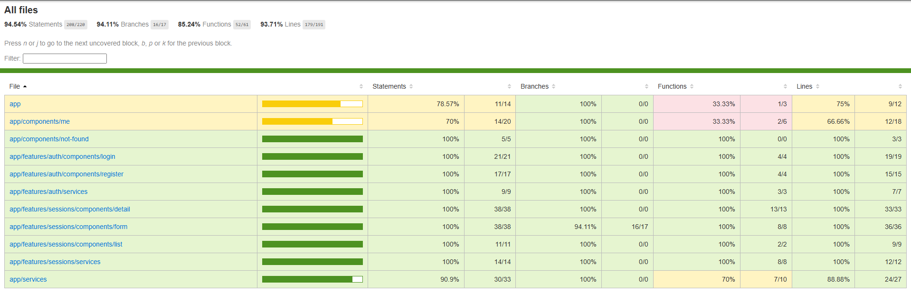
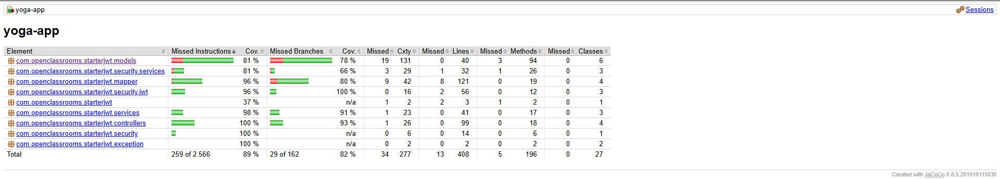
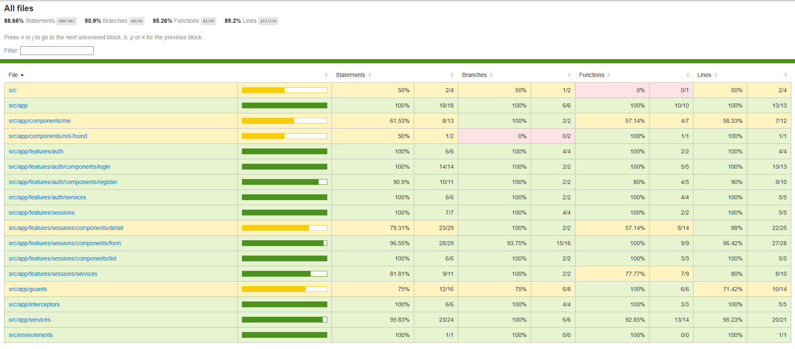

# Yoga App

Application full-stack de gestion de sessions de yoga : back-end Spring Boot (Java) exposant une API REST sécurisée par JWT, front-end Angular consommant cette API.

## Stack technique

- **Back-end** : Java 8, Spring Boot 2.6.1, Spring Data JPA, Spring Security, JWT, MySQL, Maven
- **Front-end** : Angular, Angular Material
- **Tests** : JUnit / Mockito (back-end), Jest (front-end), Cypress (end-to-end)

## Prérequis

- JDK 8
- Maven
- Node.js et npm
- MySQL (serveur local sur le port 3306)

## Installation

### 1. Cloner le repository

```bash
git clone https://github.com/SiretNathan-net/openclassroom-p5.git
cd openclassroom-p5
```

### 2. Base de données

Crée une base MySQL nommée `test` avec l'utilisateur attendu par `application.properties`, puis exécute le script de création des tables et des données de départ (`ressources/sql/script.sql` à la racine du projet back-end) :

```bash
mysql -u root -p -e "CREATE DATABASE test; CREATE USER 'user'@'localhost' IDENTIFIED BY '123456'; GRANT ALL PRIVILEGES ON test.* TO 'user'@'localhost'; FLUSH PRIVILEGES;"
mysql -u user -p123456 test < ressources/sql/script.sql
```

Le script crée les tables `TEACHERS`, `SESSIONS`, `USERS` et `PARTICIPATE`, ajoute deux enseignants de démonstration, et crée un compte administrateur :

| Email | Mot de passe |
|---|---|
| `yoga@studio.com` | `test!1234` |

### 3. Configuration du back-end

La configuration se trouve dans `back/src/main/resources/application.properties` et pointe par défaut vers la base créée à l'étape précédente :

```properties
spring.datasource.url=jdbc:mysql://localhost:3306/test?allowPublicKeyRetrieval=true
spring.datasource.username=user
spring.datasource.password=123456
```

Aucune modification n'est nécessaire si l'étape 2 a été suivi.

### 4. Lancer le back-end

```bash
cd back
mvn spring-boot:run
```

Le serveur démarre sur `http://localhost:8080`.

### 5. Lancer le front-end

Dans un nouveau terminal :

```bash
cd front
npm install
npm start
```

L'application est accessible sur `http://localhost:4200`.

## Lancer les tests

### Back-end (JUnit / Mockito)

```bash
cd back
mvn clean test
```

Le rapport de couverture JaCoCo est généré dans `back/target/site/jacoco/index.html`.

> Sur Mac, si tu obtiens une erreur `JAVA_HOME variable is not defined correctly`, vérifie que `JAVA_HOME` pointe vers un JDK 8 :
> ```bash
> export JAVA_HOME=$(/usr/libexec/java_home -v 1.8)
> ```

### Front-end (Jest)

```bash
cd front
npm run test
```

Pour générer le rapport de couverture :

```bash
npm run test -- --coverage
```

Le rapport est généré dans `front/coverage/jest/lcov-report/index.html`.

### End-to-end (Cypress)

Le front-end doit être démarré (`npm start`) avant de lancer les tests e2e, car Cypress teste l'application sur `http://localhost:4200`. Les appels API sont entièrement mockés (`cy.intercept()`), donc le back-end n'a pas besoin de tourner pour cette phase.

Mode interactif :

```bash
cd front
npm run cypress:open
```

Mode headless (tous les fichiers) :

```bash
npx cypress run
```

Rapport de couverture e2e :

```bash
npm run e2e:coverage
```

Le rapport HTML est généré dans `front/coverage/lcov-report/index.html`.

## Couverture de code

| Phase | Statements | Branches | Functions | Lines |
|---|---|---|---|---|
| Front-end (Jest) | 94.54% | 94.11% | 85.24% | 93.71% |
| Back-end (JUnit) | 89% (instructions) | 82% | — | — |
| End-to-end (Cypress) | 88.66% | 90.9% | 85.26% | 89.2% |

Les DTO (`com/openclassrooms/starterjwt/dto`) et les payloads (`com/openclassrooms/starterjwt/payload`) sont exclus du calcul de couverture back-end, conformément aux directives du projet.

### Rapports de couverture

**Front-end (Jest)**


**Back-end (JaCoCo)**


**End-to-end (Cypress)**
